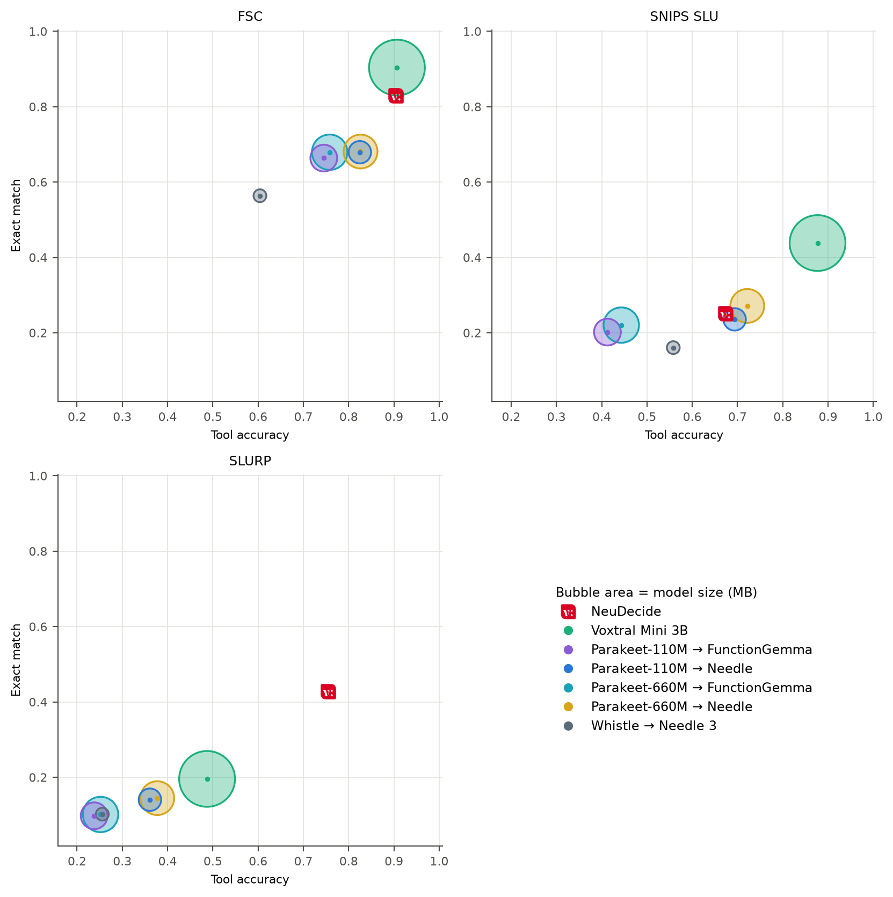

# neudecide
A tiny voice-action model, built to run on any device.

## Results

  

Exact match against tool accuracy on FSC, SNIPS SLU and SLURP, choosing from 10 tools. Each bubble is one system, and its area is the model's size on disk; a cascade counts its ASR and decision model together. ([PDF](assets/param_bubbles.pdf))
